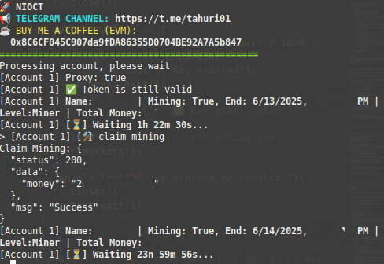

# BOT NIOCT



**Fitur:**

**• Multi Account**

**• Auto Start Mining**

**• Supports Proxy w/o Proxy**

## Requirements

Before running this project, make sure you have installed:

- Node.js
- npm (Node Package Manager)

## Installation

1. **Clone this repository:**

    ```plaintext
    git clone https://github.com/wrightL-dev/NIOCT
    cd NIOCT

2. **Install the required packages:**

    ```plaintext
    npm install axios cycletls qs https-proxy-agent socks-proxy-agent

2. **Add your accounts in the queries.txt file. Example:**

    ```plaintext
   query_id=xxxxx

4. **If you want to use a proxy, edit the proxy.txt file. Example:**
   ```plaintext
   http://username:password@ip:port

5. **Run the script:**
   ```plaintext
   node nioct.js
   
## Support

If you have any questions or need further assistance, feel free to join our Telegram channel at [t.me/tahuri01](https://t.me/tahuri01).

## License

This project is licensed under the [MIT License](LICENSE).
